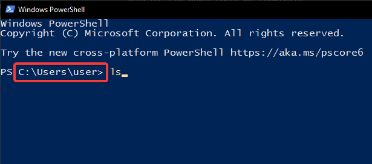

# Terminal

[Wróć do listy instrukcji](./README.md)

Aby nie mieć problemów z używaniem Node.js (Angular, Typescript) musisz nauczyć się poruszania po terminalu.

## Wybór odpowiedniej aplikacji terminala

Najlepiej jest używać Powershella (powinieneś go nazywać po prostu terminalem) ponieważ obsługuje najlepsze komendy (komendy Linuxa) i jest zainstalowany na każdym nowszym Windowsie.

## Jak uruchomić terminal

1. Wciśnij kombinację klawiszy `Win+R`
2. Wpisz `powershell` i wciśnij `Enter`

## Interfejs

Fragment obrazka otoczony czerwoną ramką oznacza ścieżkę w systemie w której aktualnie się znajdujesz. (moja nazwa użytkownika brzmi `user`)  

## Komendy

Komendy wbudowane:

- `cd <nazwa katalogu>` - przejdź do katalogu
- `ls <nieobowiązkowa nazwa katalogu>` - wyświetl zawartość katalogu (jeżeli nie podasz nazwy to wyświetli zawartość bieżącego katalogu)
- `mkdir <nazwa katalogu>` - utwórz katalog
- `clear` - czyszczenie widoku terminala (historii komend)
- `exit` - zamknij terminal (jest to lepsze niż klikanie X jeżeli masz ręce na klawiaturze)

Komendy zewnętrzne (do zainstalowanego wcześniej oprogramowania):

- `code <nazwa katalogu lub pliku>` - otwórz plik w edytorze Visual Studio Code
- `npm init` - tworzenie projektu Node.js
- `ng new <nazwa projektu>` - tworzenie nowego projektu Angular

## Dlaczego komendy są ważne?

Istnieje kilka powodów:

- Jeżeli nie będziesz umiał poruszać się po katalogach samodzielnie i świadomie narobisz sobie niepotrzebnego bałaganu w systemie plików i nie będziesz wiedział gdzie co jest.
- Aby utworzyć projekt Angular, musisz wybrać odpowiedni katalog do utworzenia pliku bo chyba nie chcesz tego robić w głównym katalogu swojego konta gdzie jest pierdyliard innych plików.
- Filip Programista nie będzie za każdym razem by ci powiedzieć co wpisać w terminalu aby utworzyć/otworzyć projekt dla Szefa.

Wyjątki:
- Aby łatwo poradzić sobie z bałaganem w plikach najlepiej utworzyć folder w głównym katalogu twojego konta użytkownika i tworzyć w nim wszystkie projekty.
- Przykładem aplikacji która ułatwia pracę z terminalem i pozwala na brak znajomości tych komend jest Visual Studio Code. Otwierasz w nim katalog z gotowym projektem i nie musisz się martwić gdzie jesteś w systemie plików.
